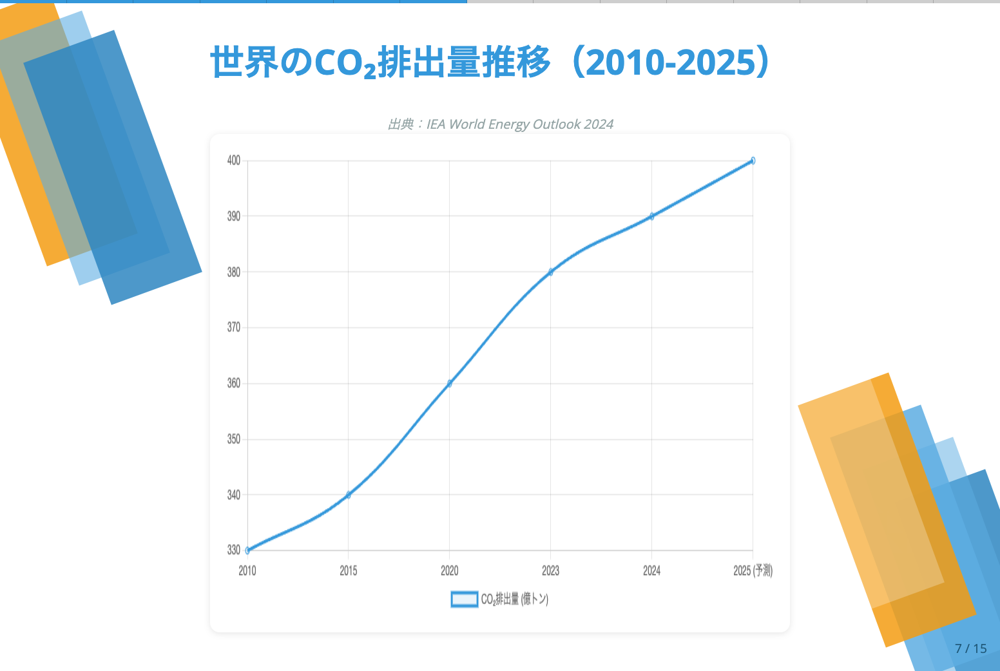

# スライド生成スキル

Claude Codeで**プレゼンテーションスライドを自動生成**できるスキルです。

## できること

Markdownファイルや文章を渡すだけで、プロフェッショナルなプレゼンテーションスライドが完成します。

- **Markdownから自動生成**: 箇条書きやテーブル、コードなどを美しいスライドに変換
- **Chart.jsグラフ対応**: データを渡せば自動的にグラフを描画
- **16種類のレイアウト**: タイトル、箇条書き、表、グラフ、コード、画像など多彩なレイアウトに自動判定
- **インタラクティブ機能**: キーボード操作、サムネイル一覧、プログレスバー
- **デプロイまで完了**: Surge.shへの自動デプロイで即座にURLを共有可能

## スライド例

### タイトルスライド


### グラフスライド（Chart.js）


### テーブルスライド


## 使い方

**スライドにしたい内容を送るだけです。**

1. **Claude Codeで内容を送る**
   ```
   気候変動とテクノロジーについてのプレゼンを作ってください。
   タイトル、現状の課題、技術的解決策、ロードマップを含めてください。
   ```

2. **必要に応じて追加情報を提供**
   - 画像が必要な場合は添付またはURLを提供
   - グラフにしたいデータがあれば数値を提供
   - （Claude Codeから求められた場合のみ）

3. **完成**
   - 自動的にレイアウト判定
   - HTML生成
   - サムネイル作成
   - Surge.shにデプロイ
   - URLが発行されます

### 重要なポイント

- **Markdownファイルを作る必要はありません**
- **特定のフォーマットは不要です**
- **レイアウトは自動判定されます**
- すべての処理が自動化されています

## デモ

実際に生成されたスライド: https://abalol.surge.sh/climate-tech/

---

**一切コーディング不要で、プレゼンテーションが完成します。**
